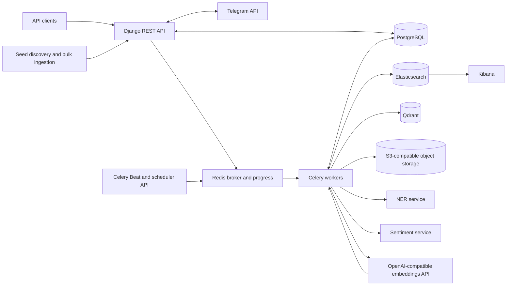
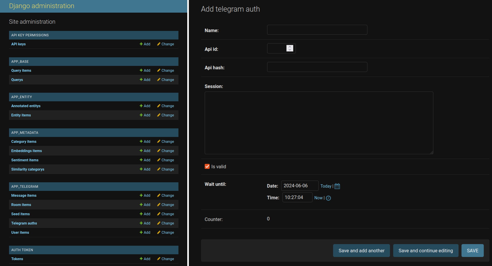

# Atenea

## Quick links
* [Development deployment](./atenea_api/docs/dev_deployment.md)
* [Production deployment](./atenea_api/docs/prod_deployment.md)
* [Environment variables](./atenea_api/docs/enviroments.md)
* [Extra configuration](./atenea_api/docs/configuration.md)

## Table of contents

* [Overview](#overview)
* [Architecture and Design](#architecture-and-design)

  * [Platform architecture](#platform-architecture)
  * [API design](#api-design)
  * [Platform Workflow](#platform-workflow)
* [Installation](#installation)
* [Quick Start](#quick-start)
* [Configuration](#configuration)
* [Reproducibility Notes](#reproducibility-notes)
* [License](#license)
* [Citation](#citation)

## Overview

Atenea is a platform for continuous Telegram monitoring and the construction of persistent, enriched repositories. It combines seed-based channel discovery, credential-aware data collection, Named Entity Recognition (NER), sentiment analysis, embeddings, attachment cataloguing and preservation, and retrieval through lexical, semantic, and structured queries.

The platform uses Elasticsearch for lexical and structured search and Qdrant for vector storage and semantic retrieval. This enables tasks such as longitudinal analysis, monitoring of entities or topics, anomaly-oriented time-series exploration, and dataset construction.

Atenea specializes in monitoring Telegram channels, facilitating the early detection of organized attacks, such as the spread of disinformation or spam, in their initial stages.

Atenea's technological architecture is built on Django REST Framework, which forms the main core of the project. PostgreSQL is used for relational persistence and attachment metadata, Elasticsearch for keyword search, Qdrant for vector storage and semantic retrieval, and S3-compatible object storage for downloaded Telegram media. The platform also uses FastAPI for auxiliary microservices and Kibana for Elasticsearch dashboards.

## Architecture and Design

The main component is a modular Django REST Framework API that coordinates
ingestion, persistence, processing, and retrieval while delegating specialised
NLP and embedding workloads to external services.

Long-running ingestion and processing requests are executed asynchronously by
**Celery**, with **Redis** acting as broker and media-progress store. The main
pipelines include:

- seed population and room access recovery;
- room and comment scanning;
- NER extraction, sentiment analysis, categorization, and embeddings;
- Elasticsearch indexing and Qdrant vector synchronization;
- Telegram attachment metadata collection and selective S3-compatible storage;
- external cloud/download URL cataloguing.

Celery Beat and the scheduler API can run these operations recurrently for
continuous monitoring.

Moreover, the API integrates services for computationally intensive workloads,
allowing each processing component to scale independently. The local FastAPI
microservices can operate behind a load balancer, while embeddings are consumed
through an OpenAI-compatible endpoint and stored in Qdrant. Currently, the local
microservices are:
- NER service: specializes in Named Entity Recognition.
- Sentiment service: specializes in sentiment classification.

Finally, Kibana can be used by advanced users to create interactive dashboards for data visualization and analysis over Elasticsearch indexes.

### Platform architecture


1.  **Discover Service**: This component has spiders that are responsible for crawling and gathering information, focusing on discovering groups, channels, and bots within the Telegram network by searching different web pages or social networks.
    
2.  **Atenea API**:
    -   **Authorization**: This area ensures that only authorized users or systems can access some API endpoints, by using authentication tokens.
    -   **API Endpoints**: These are the interfaces through which clients interact with Atenea's services. They handle incoming requests and send back the appropriate responses.
    -   **ETL Pipelines**:
        -   **Message Broker**: A Redis database that queues messages (tasks) to be processed. It acts as a middleman between the API endpoints and the workers.
        -   **Workers**: These are background processes powered by Celery that execute tasks from the message broker, such as data ingestion and post-processing.
3.  **Storage and Database**:
    -   **Relational Database**: A PostgreSQL database used for structured data storage.
    -   **Elasticsearch**: Search indexes optimized for lexical and structured information retrieval.
    -   **Qdrant**: A vector database used for message embeddings and semantic search.
    -   **S3-compatible object storage**: Stores selectively downloaded Telegram media. PostgreSQL retains the associated filename, MIME type, size, SHA-256 hash, status, object key, and message/room provenance.
4.  **Kibana**: A data visualization dashboard for Elasticsearch that provides visualization capabilities on top of the content indexed on an Elasticsearch cluster.
5. **External APIs**:
    -   **Telegram API**: Telegram API for downloading data.
6.  **Load Balancer**: This component distributes incoming network traffic across multiple instances of the API NER service, ensuring no single server bears too much demand.
	- **API NER**: A microservice used by the platform to perform Named Entity Recognition (NER) during data ingestion.
	- **API Sentiment**: A microservice used by the platform to classify sentiment labels.
7.  **Embeddings provider**: An OpenAI-compatible embeddings API, such as OpenAI, vLLM, or Ollama. Atenea stores the resulting vectors in Qdrant.
    
8.  **Clients**: These are the end-users or systems that make requests directly to the API.
    
The entire Atenea platform is built on Django REST Framework for the backend, utilizes FastAPI for microservices development, and employs Kibana for data visualization.

In the context provided, this architecture supports the extraction and monitoring of data from Telegram channels. It is designed to detect organized attacks, misinformation, and spam by providing advanced search capabilities and data analysis tools to understand the flow of information over time.

### API design

#### General Endpoints
|                | Path                                | Description                                      |
|----------------|-------------------------------------|--------------------------------------------------|
| Tags           | `/api/v1/front/form/tags`           | Retrieve a list of tags.                         |
| Languages      | `/api/v1/front/form/languages`      | List available languages.                        |
| List Categories| `/api/v1/metadata/category`         | Retrieve a list of categories.                   |
| Scheduled Tasks| `/api/v1/scheduler/task`            | Create, inspect, update, or delete recurrent Celery tasks. |


#### Data Ingestion Endpoints
|                | Path                              | Description                                       |
|----------------|-----------------------------------|---------------------------------------------------|
| Category Bulk    | `/api/v1/metadata/category/bulk` | Inserts categories from a JSON list and calculates their embeddings. |
| Seed Bulk        | `/api/v1/tg/seed/bulk`          | Inserts Telegram seed links from a JSON list. |
| Seed Populate    | `/api/v1/tg/seed/populate`      | Takes previous ingested Telegram links and starts populating them using the Telegram API. |
| Scan Room        | `/api/v1/tg/room/scan`          | Starts scanning already populated Telegram groups/channels. |
| Recover Room Access | `/api/v1/tg/room/access`      | Recalculate access data for rooms that can no longer be reached with their stored credential. |


#### Data Processing Endpoints
|                | Path                              | Description                                       |
|----------------|-----------------------------------|---------------------------------------------------|
| Scan Comments   | `/api/v1/tg/msg/scan`            | Scan discussion comments associated with selected channel messages. |
| NER             | `/api/v1/tg/msg/ner`             | Process Named Entity Recognition (NER) on messages. |
| Embed           | `/api/v1/tg/msg/embed`           | Calculate message embeddings through the configured OpenAI-compatible provider and store vectors in Qdrant. |
| Categorize      | `/api/v1/tg/msg/categorize`      | Categorize messages with embedding-based category matching. |
| Sentiment       | `/api/v1/tg/msg/sentiment`       | Classify sentiment labels for messages.           |
| Index Messages  | `/api/v1/tg/msg/index`           | Index messages in Elasticsearch.                  |
| Vector Status   | `/api/v1/tg/msg/vector`          | Inspect vector synchronization state for messages. |
| Download Media  | `/api/v1/tg/msg/media/download`  | Catalogue Telegram media metadata or selectively download matching files into S3-compatible storage. Supports room/tag, date, language, extension, and size filters, plus `metadata_only=true`. |
| Media Progress  | `/api/v1/tg/msg/media/download/status` | Inspect Redis-backed progress for a media download token. |
| Collect URLs    | `/api/v1/tg/msg/external-url/collect` | Store whitelisted external cloud/download URLs from already scanned messages without downloading them. |
| Delete Media    | `/api/v1/tg/msg/downloadable` (`DELETE`) | Preview (`dry_run=true`) or delete scoped downloaded objects while retaining deletion state in PostgreSQL. |


#### Search endpoints
The main search routes are stable. Query parameters, filters, ordering fields,
and pagination details are documented in the Swagger schema.

|                | Path                                    | Description                                               |
|----------------|-----------------------------------------|-----------------------------------------------------------|
| Search Message | `/api/v1/tg/msg/search`                 | Elasticsearch message search.                      |
| Smart Msg Search | `/api/v1/tg/msg/ai`                   | Qdrant-backed semantic message search.             |
| Downloadable Catalog | `/api/v1/tg/msg/downloadable`     | Retrieve Telegram media metadata, signed links for stored objects, and whitelisted external URLs grouped by room. |
| Search Room    | `/api/v1/tg/room/search`                | Elasticsearch room search.                         |
| Room Suggest   | `/api/v1/tg/room/search/suggest`        | Get room suggestions.                              |
| Message Statistics | `/api/v1/stats/msg`                 | Aggregate message counts by day, week, month, or year, optionally calculating a z-score. |


Any additional endpoint can be found on the documentation page, http://127.0.0.1:8000/swagger

### Platform Workflow

#### Tags as collection selectors
Tags are user-defined labels assigned to seeds to organise related Telegram
resources into reproducible collections, for example `collection-june-2026`, `spain-elections`, or
`project-x`. When a seed is populated, its tags are propagated to the resulting
room. Message operations then select messages through the tags of their source
rooms, so the same collection identifier can be reused across the complete
workflow:

```text
seed ingestion -> room population -> scanning -> enrichment/indexing
-> attachment processing -> statistics and retrieval
```

For example, `tag=darkgram` restricts each compatible endpoint to rooms derived
from that collection and to their messages. Multiple `tag` parameters can be
combined with `tag_match=any` (the default) or `tag_match=all`. Tags are
collection metadata; they are distinct from Telegram hashtags, extracted
entities, and embedding-based categories.

#### 1. Channel/group scouting
First, we should search for Telegram channels by creating spiders and scraping webpages and social networks. Another option is to select those desired channels manually.

#### 2. Enabling the Telegram API
To use the Telegram API for data extraction, access credentials associated with a phone number are required. These accounts can be easily added from the administration panel in the TelegramAuth model (http://127.0.0.1:8000/admin/app_telegram/telegramauth/).



- When the platform receives a request related to data extraction from Telegram, it automatically distributes the load among the available credentials.
- Each credential can perform up to 200 `ResolveUsername` operations per day. This limit applies to resolving new usernames, not to scanning messages from known rooms. Once a room has been resolved, Atenea reuses its Telegram ID and access hash, allowing substantially larger message volumes to be monitored.
- If Telegram returns a `FloodWait`, Atenea records the waiting period and avoids reusing the affected credential until it becomes available.
- This system allows for a straightforward increase in data extraction capacity by adding more credentials.

#### 3.1 ETL Pipeline: Create seeds 
Once channels have been selected, call `/api/v1/tg/seed/bulk` and assign the
tags that identify their collection:
```
[
    {
        "link": "https://t.me/<CHANNEL>",
        "tags": [
            "tag1",
            "tag2"
        ]
    },
    {
        "link": "https://t.me/<CHANNEL>",
        "tags": [
            "tag1",
            "tag2"
        ]
    },
		...
]
```

#### 3.2 ETL Pipeline: Populate seeds to enable its monitoring
Each inserted link becomes a `SeedItem` waiting to be resolved into a monitorable room. Use `/api/v1/tg/seed/populate` to process selected seeds. Requests can be scoped by resource/title match, tag, language, resource type, and collection date.

#### 3.3 ETL Pipeline: Scan channels/groups to retrieve messages
Populated rooms can be scanned recurrently through `/api/v1/tg/room/scan`.
Rooms can be selected by name, tag, language, room type, or last-update range,
and each request can limit the number of messages retrieved per room. The
default scan workflow stores new messages and runs the configured text
post-processing and indexing stages. Channel comments can be collected
separately through `/api/v1/tg/msg/scan`.

#### 3.4 ETL Pipeline: Catalogue or preserve attachments
After messages have been scanned, `/api/v1/tg/msg/media/download` can catalogue
Telegram attachment metadata without transferring the payload
(`metadata_only=true`) or selectively store matching files in S3-compatible
object storage. Downloaded objects retain their source-message provenance,
SHA-256 hash, risk flags, and processing state. The same collection can also be
scanned for whitelisted external download URLs through
`/api/v1/tg/msg/external-url/collect`.

#### 4. Search and analyze data
Once the platform has a relevant amount of messages indexed in Elasticsearch, the search endpoint `/api/v1/tg/msg/search` will be ready for retrieval. It is also available to search by channels with the `/api/v1/tg/room/search` endpoint. Semantic search is available through `/api/v1/tg/msg/ai` when embeddings have been calculated and synchronized with Qdrant.

Message activity can be aggregated through `/api/v1/stats/msg`, while
downloaded media and external references can be retrieved through
`/api/v1/tg/msg/downloadable`. Stored media are exposed through temporary
S3-compatible presigned URLs rather than public bucket access. Kibana dashboards
can additionally be created over the Elasticsearch indexes.


## Installation

Atenea is organized as a multi-component research software project:

- `atenea_api`: the main Django REST Framework API.
- `atenea_services`: auxiliary FastAPI microservices for NER and sentiment analysis.

The recommended setup is to start the required infrastructure services with Docker and run the API in a Python virtual environment.

1. Create the environment file from the public template:
   ```bash
   cp .env.example .env.dev
   ```

2. Fill in the required values in `.env.dev`. Do not use quotes around values that are consumed by Docker.

3. Start the development infrastructure from `atenea_api`:
   ```bash
   cd atenea_api
   docker-compose -f development.yaml --env-file ../.env.dev -p atenea-dev up -d
   ```

4. Create and activate a Python environment for the API:
   ```bash
   python3.11 -m venv venv
   . venv/bin/activate
   pip install -r requirements.txt
   ```

5. Run the initial Django setup:
   ```bash
   export DJANGO_SETTINGS_MODULE=atenea_api.settings.development
   python manage.py migrate
   python manage.py createsuperuser
   ```

Detailed deployment instructions are available in [`atenea_api/docs/dev_deployment.md`](./atenea_api/docs/dev_deployment.md) and [`atenea_api/docs/prod_deployment.md`](./atenea_api/docs/prod_deployment.md).

## Quick Start

After installing the API dependencies and starting the infrastructure services:

1. Launch the Django development server:
   ```bash
   cd atenea_api
   . venv/bin/activate
   export DJANGO_SETTINGS_MODULE=atenea_api.settings.development
   python manage.py runserver
   ```

2. Start the Celery workers required by the pipeline in separate terminals:
   ```bash
   celery -A atenea_api beat -l INFO
   celery -A atenea_api worker -Q default -n AT1@%h -l INFO --concurrency=4
   celery -A atenea_api worker -Q index-q -n AT2@%h -l INFO --concurrency=1
   celery -A atenea_api worker -Q ner-q -n AT3@%h -l INFO --concurrency=2
   celery -A atenea_api worker -Q embed-q -n AT4@%h -l INFO --concurrency=1
   celery -A atenea_api worker -Q sentiment-q -n AT5@%h -l INFO --concurrency=1
   ```

3. Open the API documentation at `http://127.0.0.1:8000/swagger`.

4. Configure at least one Telegram API credential from the Django admin before using endpoints that extract data from Telegram.

## Configuration

Configuration is handled through environment variables. Use `.env.example` as the public template and keep local `.env.*` files private.

The main configuration groups are:

- Django: settings module, secret key, logging level, timezone, and auth.
- PostgreSQL and Redis: relational storage and Celery broker.
- Elasticsearch: keyword indexes and Kibana-backed analysis.
- Qdrant: vector collections for semantic search and categorization.
- S3-compatible object storage: optional binary preservation, metadata-only attachment cataloguing, presigned download URLs, file-size limits, and cleanup controls.
- External URL catalogue: built-in provider whitelist plus optional domains configured through `MEDIA_EXTERNAL_URL_WHITELIST_EXTRA`.
- OpenAI-compatible embeddings provider: OpenAI, vLLM, Ollama, or another compatible endpoint.
- Microservices: NER and sentiment service hosts, ports, limits, and API keys.
- Telegram API: credentials configured through the admin panel.

See [`atenea_api/docs/enviroments.md`](./atenea_api/docs/enviroments.md) for the
full list of variables and
[`atenea_api/docs/configuration.md`](./atenea_api/docs/configuration.md) for
first-time platform configuration.

The end-to-end REST workflow is documented in
[`atenea_api/docs/api_usage.md`](./atenea_api/docs/api_usage.md).

## Reproducibility Notes

This repository is intended to be published as research software. To reproduce a deployment, users should rely on the tracked source code, Docker compose files, requirements files, and `.env.example` templates.

For privacy, security, and storage reasons, the public repository should not include:

- `.env.dev`, `.env.prod`, or any environment file containing real values.
- API keys, OAuth secrets, JWT secrets, Telegram sessions, or certificates.
- PostgreSQL, Redis, Elasticsearch, or Qdrant data volumes.
- Private Telegram datasets, exported CSV/JSON files, logs, or temporary analysis files.
- Downloaded machine-learning model binaries unless their license and size make redistribution appropriate.

External models and services must be downloaded or configured by the user during installation. Required model information is documented in [`atenea_api/models/README.md`](./atenea_api/models/README.md) and [`atenea_services/README.md`](./atenea_services/README.md).

## License

Atenea is distributed under the MIT License. See [`LICENSE`](./LICENSE) for the full license text.

## Citation

If you use Atenea in academic work, please cite the accompanying SoftwareX paper. The full bibliographic reference and DOI will be added here once the article is published.

Pending citation entry:

```bibtex
@article{atenea_softwarex,
  title = {Atenea: A software platform for Telegram monitoring and analysis},
  author = {de Paz, Alfonso and Arroyo, David},
  journal = {SoftwareX},
  year = {2026},
  note = {Manuscript submitted or in preparation}
}
```
