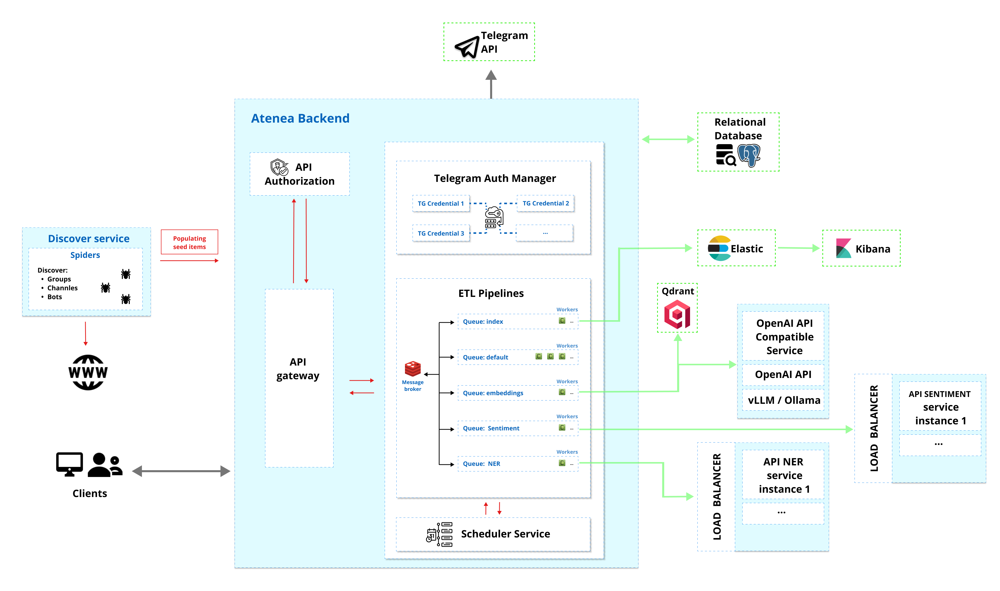

# Atenea

## Overview

Atenea is an innovative platform designed to optimize the extraction of data from Telegram and process this information using state-of-the-art techniques. These techniques include Named Entity Recognition (NER) and the calculation of embeddings for subsequent categorization and sentiment analysis.

The platform offers advanced search capabilities through search engines using indexes and vector databases, utilizing Elasticsearch. This enables various tasks such as data analysis, monitoring of entities or topics, and even understanding the flow of information over a specific period.

Atenea specializes in monitoring Telegram channels, facilitating the early detection of organized attacks, such as the spread of disinformation or spam, in their initial stages.

Atenea's technological architecture is built on Django REST Framework, which forms the main core of the project. PostgreSQL is used for relational persistence, Elasticsearch for keyword search, and Qdrant for vector storage and semantic retrieval. The platform also uses FastAPI for auxiliary microservices and Kibana for Elasticsearch dashboards.

## Architecture and Design

The platform's main system is the API module, which is responsible for managing all requests, both for data ingestion and retrieval, following a monolithic structure.

However, some of these requests that require a long execution time and do not require an immediate response (such as data post-processing) are sent to a message queue, which is managed by **Celery** and uses **Redis** as an intermediary. These two technologies are the ones used for the creation and execution of ETL pipelines in this project and we can currently highlight:
- Indexation
- NER extraction
- Embeddings calculation
- Message scanning (scanning + NER extraction + indexation)

Moreover, the API integrates services to handle tasks that require a higher workload, such as the use of artificial intelligence models, thereby relieving some of the load on the main monolith and allowing for more precise scalability based on needs. The local FastAPI microservices operate behind a load balancer, facilitating horizontal scalability by increasing or decreasing computational power on demand. Embeddings are consumed through an OpenAI-compatible endpoint and stored in Qdrant. Currently, the local microservices are:
- NER service: specializes in Name Entity Recognition.
- Sentiment service: specializes in sentiment classification.

Finally, Kibana can be used by advanced users to create interactive dashboards for data visualization and analysis over Elasticsearch indexes.

### Platform architecture
The architecture diagram illustrates the structure and components of the Atenea platform. Here's a detailed description of each component and their interrelations:



1.  **Discover Service**: This component has spiders that are responsible for crawling and gathering information, focusing on discovering groups, channels, and bots within the Telegram network by searching different web pages or social networks.
    
2.  **Atenea API**:
    -   **Authorization**: This area ensures that only authorized users or systems can access some API endpoints, by using authentication tokens.
    -   **API Endpoints**: These are the interfaces through which clients interact with Atenea's services. They handle incoming requests and send back the appropriate responses.
    -   **ETL Pipelines**:
        -   **Message Broker**: A Redis database that queues messages (tasks) to be processed. It acts as a middleman between the API endpoints and the workers.
        -   **Workers**: These are background processes powered by Celery that execute tasks from the message broker, such as data ingestion and post-processing.
3.  **Storage and Database**:
    -   **Relational Database**: A PostgreSQL database used for structured data storage.
    -   **Elastic**: An ElasticSearch cluster, whose indexes are optimized for search operations used for information retrieval.
    -   **Qdrant**: A vector database used for message embeddings and semantic search.
4.  **Kibana**: A data visualization dashboard for Elasticsearch that provides visualization capabilities on top of the content indexed on an Elasticsearch cluster.
5. **External APIs**:
    -   **Telegram API**: Telegram API for downloading data.
6.  **Load Balancer**: This component distributes incoming network traffic across multiple instances of the API NER service, ensuring no single server bears too much demand.
	- **API NER**: A microservice used by the platform to perform Name Entity Recognition (NER) during the data ingestion. 
	- **API Sentiment**: A microservice used by the platform to classify sentiment labels.
7.  **Embeddings provider**: An OpenAI-compatible embeddings API, such as OpenAI, vLLM, or Ollama. Atenea stores the resulting vectors in Qdrant.
    
8.  **Clients**: These are the end-users or systems that make requests directly to the API.
    
The entire Atenea platform is built on Django REST Framework for the backend, utilizes FastAPI for microservices development, and employs Kibana for data visualization.

In the context provided, this architecture supports the extraction and monitoring of data from Telegram channels. It is designed to detect organized attacks, misinformation, and spam by providing advanced search capabilities and data analysis tools to understand the flow of information over time.

### API design

#### General Endpoints
|                | Path                                | Description                                      |
|----------------|-------------------------------------|--------------------------------------------------|
| Tags           | `/api/v1/front/form/tags`           | Retrieve a list of tags.                         |
| Languages      | `/api/v1/front/form/languages`      | List available languages.                        |
| List Categories| `/api/v1/metadata/category`         | Retrieve a list of categories.                   |


#### Data Ingestion Endpoints
|                | Path                              | Description                                       |
|----------------|-----------------------------------|---------------------------------------------------|
| Category Bulk    | `/api/v1/metadata/category/bulk` | Inserts categories from a JSON list and calculates their embeddings. |
| Seed Bulk        | `/api/v1/tg/seed/bulk`          | Inserts Telegram seed links from a JSON list. |
| Seed Populate    | `/api/v1/tg/seed/populate`      | Takes previous ingested Telegram links and starts populating them using the Telegram API. |
| Scan Room        | `/api/v1/tg/room/scan`          | Starts scanning already populated Telegram groups/channels. |


#### Data Processing Endpoints
|                | Path                              | Description                                       |
|----------------|-----------------------------------|---------------------------------------------------|
| Scan Replies    | `/api/v1/tg/msg/scan`            | Scan replies for selected messages.               |
| NER             | `/api/v1/tg/msg/ner`             | Process name entity recognition (NER) on messages. |
| Embed           | `/api/v1/tg/msg/embed`           | Calculate message embeddings through the configured OpenAI-compatible provider and store vectors in Qdrant. |
| Categorize      | `/api/v1/tg/msg/categorize`      | Categorize messages with embedding-based category matching. |
| Sentiment       | `/api/v1/tg/msg/sentiment`       | Classify sentiment labels for messages.           |
| Index Messages  | `/api/v1/tg/msg/index`           | Index messages in Elasticsearch.                  |
| Vector Status   | `/api/v1/tg/msg/vector`          | Inspect vector synchronization state for messages. |


#### Search endpoints
The main search routes are stable. Query parameters, filters, ordering fields,
and pagination details are documented in the Swagger schema.

|                | Path                                    | Description                                               |
|----------------|-----------------------------------------|-----------------------------------------------------------|
| Search Message | `/api/v1/tg/msg/search`                 | Elasticsearch message search.                      |
| Smart Msg Search | `/api/v1/tg/msg/ai`                   | Qdrant-backed semantic message search.             |
| Search Room    | `/api/v1/tg/room/search`                | Elasticsearch room search.                         |
| Room Suggest   | `/api/v1/tg/room/search/suggest`        | Get room suggestions.                              |


Any additional endpoint can be found on the documentation page, http://127.0.0.1:8000/swagger

### Platform Workflow

#### 1. Channel/group scouting
First, we should search for Telegram channels by creating spiders and scraping webpages and social networks. Another option is to select those desired channels manually.

#### 2. Enabling the Telegram API
To use the Telegram API for data extraction, access credentials associated with a phone number are required. These accounts can be easily added from the administration panel in the TelegramAuth model (http://127.0.0.1:8000/admin/app_telegram/telegramauth/).


- When the platform receives a request related to data extraction from Telegram, it automatically distributes the load among the available credentials to avoid reaching the daily rate limit as much as possible.
- If a credential reaches the rate limit, it properly finishes its extraction work and becomes invalid until its timeout period expires.
- This system allows for a straightforward increase in data extraction capacity by adding more credentials.
- Approximately, three credentials allow for the extraction of about 250,000 messages per day.

#### 3.1 ETL Pipeline: Create seeds 
Once we have extracted some channels we need to call the bulk endpoint `/api/v1/tg/seed/bulk` and attach them with the following JSON structure:
```
[
    {
        "link": "https://t.me/<CHANNEL>",
        "tags": [
            "tag1",
            "tag2"
        ]
    },
    {
        "link": "https://t.me/<CHANNEL>",
        "tags": [
            "tag1",
            "tag2"
        ]
    },
		...
]
```

#### 3.2 ETL Pipeline: Populate seeds to enable its monitoring
Each inserted link will be a `SeedItem` inside the system waiting to be populated. To do this, it is necessary to use the `/api/v1/tg/seed/populate` populating endpoint, which allows a `date-start` and `date-end` parameter to populate only SeedItems ingested between a period.

#### 3.3 ETL Pipeline: Scan channels/groups to retrieve messages
Finally, all populated channels are ready to be periodically scanned by the `/api/v1/tg/room/scan` scanning endpoint, which allows filters by category or last update date range, to choose only those channels that meet the requirements. During the scanning, each extracted message will be processed to detect its language, clean its text, and perform name entity recognition.

#### 4. Search and Analyze data
Once the platform has a relevant amount of messages indexed in Elasticsearch, the search endpoint `/api/v1/tg/msg/search` will be ready for retrieval. It is also available to search by channels with the `/api/v1/tg/room/search` endpoint. Semantic search is available through `/api/v1/tg/msg/ai` when embeddings have been calculated and synchronized with Qdrant.

In addition, Kibana dashboards can be created to monitor and improve the data analysis.


## Installation

Atenea is organized as a multi-component research software project:

- `atenea_api`: the main Django REST Framework API.
- `atenea_services`: auxiliary FastAPI microservices for NER and sentiment analysis.

The recommended setup is to start the required infrastructure services with Docker and run the API in a Python virtual environment.

1. Create the environment file from the public template:
   ```bash
   cp .env.example .env.dev
   ```

2. Fill in the required values in `.env.dev`. Do not use quotes around values that are consumed by Docker.

3. Start the development infrastructure from `atenea_api`:
   ```bash
   cd atenea_api
   docker-compose -f development.yaml --env-file ../.env.dev -p atenea-dev up -d
   ```

4. Create and activate a Python environment for the API:
   ```bash
   python3.11 -m venv venv
   . venv/bin/activate
   pip install -r requirements.txt
   ```

5. Run the initial Django setup:
   ```bash
   export DJANGO_SETTINGS_MODULE=atenea_api.settings.development
   python manage.py migrate
   python manage.py createsuperuser
   ```

Detailed deployment instructions are available in [`atenea_api/docs/dev_deployment.md`](./atenea_api/docs/dev_deployment.md) and [`atenea_api/docs/prod_deployment.md`](./atenea_api/docs/prod_deployment.md).

## Quick Start

After installing the API dependencies and starting the infrastructure services:

1. Launch the Django development server:
   ```bash
   cd atenea_api
   . venv/bin/activate
   export DJANGO_SETTINGS_MODULE=atenea_api.settings.development
   python manage.py runserver
   ```

2. Start the Celery workers required by the pipeline in separate terminals:
   ```bash
   celery -A atenea_api beat -l INFO
   celery -A atenea_api worker -Q default -n AT1@%h -l INFO --concurrency=4
   celery -A atenea_api worker -Q index-q -n AT2@%h -l INFO --concurrency=1
   celery -A atenea_api worker -Q ner-q -n AT3@%h -l INFO --concurrency=2
   celery -A atenea_api worker -Q embed-q -n AT4@%h -l INFO --concurrency=1
   celery -A atenea_api worker -Q sentiment-q -n AT5@%h -l INFO --concurrency=1
   ```

3. Open the API documentation at `http://127.0.0.1:8000/swagger`.

4. Configure at least one Telegram API credential from the Django admin before using endpoints that extract data from Telegram.

## Configuration

Configuration is handled through environment variables. Use `.env.example` as the public template and keep local `.env.*` files private.

The main configuration groups are:

- Django: settings module, secret key, logging level, timezone, and auth.
- PostgreSQL and Redis: relational storage and Celery broker.
- Elasticsearch: keyword indexes and Kibana-backed analysis.
- Qdrant: vector collections for semantic search and categorization.
- OpenAI-compatible embeddings provider: OpenAI, vLLM, Ollama, or another compatible endpoint.
- Microservices: NER and sentiment service hosts, ports, limits, and API keys.
- Telegram API: credentials configured through the admin panel.

See [`atenea_api/docs/enviroments.md`](./atenea_api/docs/enviroments.md) for the full list of variables and [`atenea_api/docs/configuration.md`](./atenea_api/docs/configuration.md) for first-time platform configuration.

## Reproducibility Notes

This repository is intended to be published as research software. To reproduce a deployment, users should rely on the tracked source code, Docker compose files, requirements files, and `.env.example` templates.

For privacy, security, and storage reasons, the public repository should not include:

- `.env.dev`, `.env.prod`, or any environment file containing real values.
- API keys, OAuth secrets, JWT secrets, Telegram sessions, or certificates.
- PostgreSQL, Redis, Elasticsearch, or Qdrant data volumes.
- Private Telegram datasets, exported CSV/JSON files, logs, or temporary analysis files.
- Downloaded machine-learning model binaries unless their license and size make redistribution appropriate.

External models and services must be downloaded or configured by the user during installation. Required model information is documented in [`atenea_api/models/README.md`](./atenea_api/models/README.md) and [`atenea_services/README.md`](./atenea_services/README.md).

## License

Atenea is distributed under the MIT License. See [`LICENSE`](./LICENSE) for the full license text.

## Citation

If you use Atenea in academic work, please cite the accompanying SoftwareX paper. The full bibliographic reference and DOI will be added here once the article is published.

Pending citation entry:

```bibtex
@article{atenea_softwarex,
  title = {Atenea: A software platform for Telegram monitoring and analysis},
  author = {de Paz, Alfonso and Arroyo, David},
  journal = {SoftwareX},
  year = {2026},
  note = {Manuscript submitted or in preparation}
}
```
